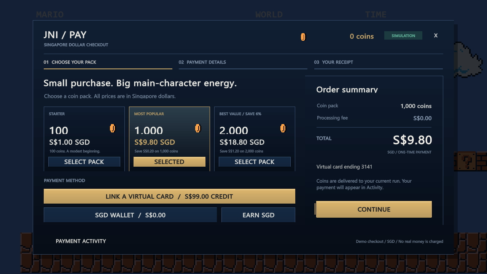

# Jump Not Included 跳跃另购

Unity 2D 课程游戏，当前源码版本 **v1.11.0**，编辑器版本 **6000.3.24f1**。
开场保留经典平台游戏的画面，死亡后出现模拟广告与升级商店。
包含两个关卡、六种升级、检查点、形态变化、星星、库巴和通关收据。
充值使用 **SGD 新加坡元**计价，支持绑定虚拟信用卡、核对金额、确认付款、查看收据和交易记录。所有交易均在本地模拟。

## 打开工程

1. 克隆或下载本仓库。
2. Unity Hub 中添加仓库里的 **`JumpNotIncluded` 子文件夹**，这一层包含 `Assets`、`Packages`、`ProjectSettings`。
3. 使用 Unity **6000.3.24f1**，等待导入和编译完成。
4. 点击 **Tools → Jump Not Included → Play from MainMenu**，或打开 `Assets/Scenes/MainMenu.unity` 后运行。
5. 游戏中选择 **1 PLAYER GAME → START**。

A/D 或左右方向键移动，Space/W 跳跃，J 射击，Esc 暂停。
基础跳跃需要先在游戏内解锁。完整操作和机制见[工程说明](JumpNotIncluded/README.md)。
Input System 1.20.0 作为嵌入包随源码保留。
Windows 可执行文件在 Unity 中通过 **Tools → Jump Not Included → Build Windows** 生成；构建产物与缓存不加入源码仓库。

## SGD 充值

死亡后打开商店，点击金币余额旁的 **＋**：选择礼包 → **CONTINUE** → **LINK VIRTUAL CARD** → **PAY S$9.80** → 查看付款收据。默认礼包为 1,000 金币，另有 S$1.00 / 100 金币和 S$18.80 / 2,000 金币。

虚拟卡提供每局 S$99.00 额度，付款后扣减额度并发放金币；绑卡免费，取消不扣款，重复确认不会重复扣款。收据保存订单号、时间、支付来源及当时的余额，死亡重试和换关均保留。也可选择 **SGD WALLET**，用广告奖励的模拟新元支付。无需填写真实卡号。



## 修改过程与代码定位

- [开发修改记录](docs/development-history.md)：从原型到当前版本的需求、问题、修改方式和证据。
- [Lab 1 代码与演示索引](docs/lab1-code-guide.md)：移动、碰撞、Game Over、计分、完整重开的代码入口。
- [当前设计文档](docs/jump-not-included-design.md)：完整玩法与后续各 Lab 的演示目标。
- [验证记录](verification/README.md)：历史运行报告、界面检查及图片的来源和范围。

**历史说明：** 开发初期没有创建 Git 提交。前三个阶段提交根据保留下来的工程快照与实际修复内容整理，提交时间表示入库时间。v1.10 是保留的源码快照，v1.10.1 是基于快照和已知修改重建的阶段，v1.10.2 来自当时的完整工程。更早的修改以文档记录保留，没有伪称存在逐次完整源码快照。GitHub 原有初始化提交也保留在历史中。**v1.11.0 起为入库后正常开发的新提交。**

## 验证

v1.11.0 的[实际运行报告](verification/unity-runtime-checks.txt)有 **161 项 PASS**，包含板栗移动、真实碰撞、音频播放位置、形态、经济规则、两关通关及新增的 16 项充值流程检查。另通过 C# 编译、纯规则检查和[充值界面验证](verification/payment-ui-checks.txt)：9 个界面状态、3 种分辨率，以及确认和取消的默认按钮分发。

旧版 145 项报告已独立保留在 [history/v1.10.2-runtime-checks.txt](verification/history/v1.10.2-runtime-checks.txt)，与本次新运行的结果区分。

本机安装 Unity 后可在 PowerShell 中运行：

```powershell
.\tools\check-project.ps1 -EditorRoot 'C:\Program Files\Unity\Hub\Editor\6000.3.24f1\Editor'
```

完整运行检查入口：**Tools → Jump Not Included → Run runtime checks**。
这些自动检查与界面图片不替代课程要求的带声音录屏，也不代表教师已经验收。

## 素材来源

保留了[游戏素材说明](JumpNotIncluded/Assets/Art/SOURCES.md)、[广告素材说明](JumpNotIncluded/Assets/Art/Ads/SOURCES.md)以及嵌入包自身的许可证。
