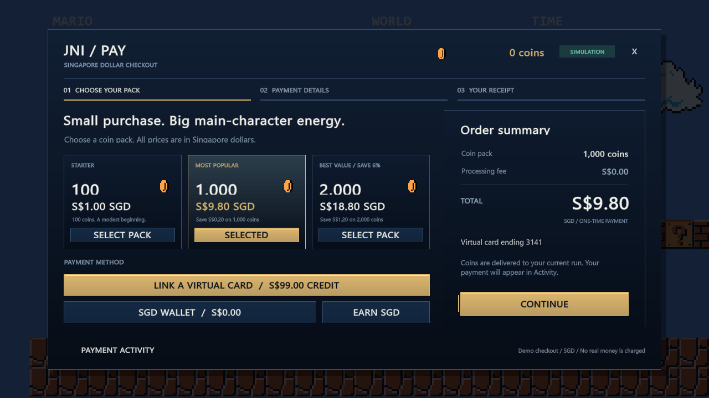

# Jump Not Included 跳跃另购

Unity 2D 课程游戏，当前源码版本 **v1.15.0**，编辑器版本 **6000.3.24f1**。
开场保留经典平台游戏的画面，死亡后出现模拟广告与升级商店。
包含两个关卡、六种金币升级、SL Cheater 联动机甲、检查点、形态变化、星星、库巴和通关收据。
充值使用 **SGD 新加坡元**计价，支持绑定虚拟信用卡、核对金额、确认付款、查看收据和交易记录。所有交易均在本地模拟。

主菜单标题下显示 **Jump Not Included**，右侧有醒目的 **FREE TO PLAY** 爆炸框。[开场画面](verification/previews/menu-free-to-play.png)

死亡后必须观看完整的 **2 秒复活广告**才能从检查点继续。死亡页没有免费重试或关闭按钮；关闭商店、充值或观看赚钱广告都不能跳过复活要求。**RESTART RUN** 会清空本局并重新开始。

## 打开工程

1. 克隆或下载本仓库。
2. Unity Hub 中添加仓库里的 **`JumpNotIncluded` 子文件夹**，这一层包含 `Assets`、`Packages`、`ProjectSettings`。
3. 使用 Unity **6000.3.24f1**，等待导入和编译完成。
4. 点击 **Tools → Jump Not Included → Play from MainMenu**，或打开 `Assets/Scenes/MainMenu.unity` 后运行。
5. 游戏中选择 **1 PLAYER GAME → START**。

A/D 或左右方向键移动，Space/W 跳跃，J 射击，Esc 暂停。购买机甲、完成复活广告与首次登场动画后，按住 Space/W 推进升空、松开悬停，S/下方向键下降，按住 J 自动锁定并释放秒杀激光。
基础跳跃需要先在游戏内解锁。完整操作和机制见[工程说明](JumpNotIncluded/README.md)。
Input System 1.20.0 作为嵌入包随源码保留。
Windows 可执行文件在 Unity 中通过 **Tools → Jump Not Included → Build Windows** 生成；构建产物与缓存不加入源码仓库。

## v1.15.0：促销广告与金币图标

死亡与广告页面改为红金促销横幅、大号卖点、商品展示、奖励卡和醒目主按钮。保留马里奥、SUTD/AI、SL Cheater 三类广告轮播；复活广告仍须看满两秒，赚钱广告仍每完整秒奖励 S$1，钱包上限 S$99。

HUD、商店、广告兑换提示、充值礼包、付款收据与结算页使用同一枚游戏金币精灵，数字 0 原样保留。礼包页增强金币堆与优惠标记；玩法、价格、支付、机甲和声音规则保持原样。

通过 31 项 UI 检查，保存 76 张 Unity 实际渲染图，覆盖 1280×720、960×540、1024×768、1920×1080。包括方向键与 Enter 按钮操作、购买禁用、充值取消／到账、复活和钱包上限。截图使用布置的测试状态。[实际广告页](verification/previews/promotions/04-cash-Mario.png) · [死亡促销页](verification/previews/promotions/03-comeback-offer.png) · [HUD 金币](verification/previews/promotions/02-hud-1000.png)。

v1.15.0 已重新通过 226 项完整 Unity 运行检查，Windows x64 构建成功。本次 31 项 UI 检查和 76 张截图为新执行结果；历史音频、推进和登场专项报告保留原版本归属。

## v1.14.1：复古像素音效

机甲改用九种本地合成的复古音效，覆盖点火、持续推进、激光、落地、护盾、轨道下降、意识接入、同步完成与加速。声音风格与现有像素画面统一，原 SL Cheater 音频保留为来源资料；实际游玩使用新音效。当前视觉、价格、操作和登场规则保持不变。

## v1.14.0：与马里奥统一的像素机甲

机甲重绘为六帧 8-bit 动作，与马里奥使用相同的有效 **16 PPU**（每个世界单位 16 个像素）：静止、两帧行走、展翼悬停与两帧横向巡航。垂直反冲和后向尾迹改为独立、不透明的三色像素喷流，激光采用方格阶梯路径，意识投入也由离散像素流表现。原 SL Cheater 立绘与图集保留为来源、展示及旧版本资料。

本次统一画面颗粒尺度；机甲 **S$79.99** 钱包价格、飞行与落地、免伤与秒杀、悬崖保护，以及 **6.2 秒不可跳过登场**的触发和保存规则保持不变。

## v1.13.1：推进方向、落地与登场表现修正（历史）

机甲在地面静止和行走时收翼，不产生尾迹或推进器循环声；升空与悬停使用没有横向尾迹的展翼帧，鞋底喷出朝下的青白反冲。原版蓝色尾迹只在空中横向飞行时出现。按 S／下方向键可真正落在地面或水管顶部，接触后停止喷流与引擎；悬崖底部仍自动悬停。

登场沿用同一展翼帧与正常机体尺寸，移除橙色火焰和巨大光环，仅在世界地面保留少量冲刷扬尘。六点二秒不可跳过的降落、流光意识接入与同步流程保持不变，原始图集未作像素修改。

## v1.13.0：轨道投送与意识接入

首次购买机甲并完成两秒复活广告后，播放 **6.2 秒不可跳过的登场动画**：机甲喷射火焰从天而降，反推减速悬停；马里奥化为流光，沿光束投入机甲核心，完成意识接入后才交还控制。画面采用 **ORBITAL DELIVERY → CONSCIOUSNESS UPLINK → SYNCHRONIZATION COMPLETE** 三段英文标题，表现意识同步，不包含生物脑移植或血腥画面。

动画期间世界暂停，Esc、Space、J、Enter 和界面操作均不能跳过；失焦暂停动画与声音，不计入游玩时间或实际操作时间。每局只在首次部署时播放，完成状态随检查点和换关保留；未播完时中断会在恢复后重新播放，完整重开重新计次。机甲售价与已有飞行、免伤和激光能力保持不变。

## v1.12.0：能力调整与 SL Cheater 联动

- **Monarch Wings 降至 999 金币**：落地或踩怪反弹都会恢复一次空中追加跳跃。
- **Gatling 降至 1999 金币**：清除前方砖块、怪物和其他有害物体；水管和悬崖保持原样，需要跳跃或飞行通过。
- **War God Replica / Moon Killer Edition · S$79.99**：直接扣广告奖励的 **SGD WALLET**，不用金币或虚拟卡。满 80 秒赚钱广告足以从零购买，购买后仍须完成独立的两秒复活广告才能继续。
- 机甲免疫库巴等所有原版怪物伤害，可推进、悬停、下降，坠入悬崖时自动保持悬停；激光自动锁定敌人并秒杀。复用 SL Cheater 武神的立绘、行走和展翼动画及推进器／激光音效。
- 英文广告突出 **STARFIELD CAMOUFLAGE / MOON KILLER / 1% LIGHT SPEED** 的夸张宣传。结算页把机甲的 SGD 钱包支出与金币支出分开列示。

## SGD 充值

死亡后打开商店，点击金币余额旁的 **＋**：选择礼包 → **CONTINUE** → **LINK VIRTUAL CARD** → **PAY S$9.80** → 查看付款收据。默认礼包为 1,000 金币，另有 S$1.00 / 100 金币和 S$18.80 / 2,000 金币。

虚拟卡提供每局 S$99.00 额度，付款后扣减额度并发放金币；绑卡免费，取消不扣款，重复确认不会重复扣款。收据保存订单号、时间、支付来源及当时的余额，死亡重试和换关均保留。也可选择 **SGD WALLET**，用广告奖励的模拟新元支付。无需填写真实卡号。



## 修改过程与代码定位

- [开发修改记录](docs/development-history.md)：从原型到当前版本的需求、问题、修改方式和证据。
- [Lab 1 代码与演示索引](docs/lab1-code-guide.md)：移动、碰撞、Game Over、计分、完整重开的代码入口。
- [当前设计文档](docs/jump-not-included-design.md)：完整玩法与后续各 Lab 的演示目标。
- [验证记录](verification/README.md)：历史运行报告、界面检查及图片的来源和范围。

**历史说明：** 开发初期没有创建 Git 提交。前三个阶段提交根据保留下来的工程快照与实际修复内容整理，提交时间表示入库时间。v1.10 是保留的源码快照，v1.10.1 是基于快照和已知修改重建的阶段，v1.10.2 来自当时的完整工程。更早的修改以文档记录保留，没有伪称存在逐次完整源码快照。GitHub 原有初始化提交也保留在历史中。**v1.11.0 起为入库后正常开发的新提交。**

## 验证

v1.14.1 已通过 226 项完整 Unity 运行检查、59 项推进专项检查和 44 项机甲音频检查，Windows x64 构建成功。九种新音效的 WAV 格式、信号分析与源码 SHA256 已核对，另保留 11.50 秒分段试听与 6.2 秒真实 Unity 登场混音；原视觉截图及登场／商品页画面报告仍归属 v1.14.0，未声称重新执行。自动检查与试听素材不替代人工游玩或课程验收录屏。

上一版本 v1.14.0 通过 226 项完整 Unity 运行检查、59 项推进专项检查、24 项登场画面检查和 15 项机甲商品页／飞行检查，保存 10 张推进图、24 张登场图和 14 张机甲图，并成功构建 Windows x64。本次保留这些视觉证据，未将旧截图当作新音效验证。[历史运行报告](verification/history/v1.14.0-runtime-checks.txt) · [历史推进报告](verification/history/v1.14.0-propulsion-checks.txt)。

上一版本 v1.13.1 通过 226 项完整 Unity 运行检查、46 项推进专项检查和 24 项登场画面检查；当时保存 9 张推进状态图与 24 张登场图，并成功构建 Windows x64。这些历史结果不包含 v1.14.0 的重绘机甲、像素喷流、激光和意识流。[历史完整报告](verification/history/v1.13.1-runtime-checks.txt) · [历史推进检查](verification/history/v1.13.1-propulsion-checks.txt) · [历史登场检查](verification/history/v1.13.1-arrival-ui-checks.txt)。

上一版本 v1.13.0 通过 **226 项 Unity Play Mode 检查**，其中登场专项报告有 23 项 PASS；当时登场画面检查有 24 项 PASS，保留 24 张实际渲染图，并成功构建 Windows x64。这些结果不包含 v1.13.1 的推进、落地和喷流修正。[v1.13.0 完整报告](verification/history/v1.13.0-runtime-checks.txt) · [历史画面与构建检查](verification/history/v1.13.0-arrival-ui-checks.txt) · [历史登场截图](verification/history/v1.13.0-arrival-previews/)。测试场景截图不替代人工试玩或带声音的课程录屏。

v1.12.0 的[历史完整运行报告](verification/history/v1.12.0-runtime-checks.txt)有 **201 项 PASS**。验证降价、保留水管与悬崖、踩怪刷新二段跳、钱包直购、机甲飞行／免伤／锁定秒杀／跨关保存，以及既有支付与两秒复活流程。当时机甲用真实键盘输入连续通关两关，途中无新增死亡；另完成[机甲界面与构建检查](verification/history/v1.12.0-mech-ui-checks.txt)：三种分辨率、真实购买按钮与飞行／激光截图，Windows x64 构建成功。这些旧结果不包含 v1.13.0 登场动画。旧 179 项报告保存在 [history/v1.11.2-runtime-checks.txt](verification/history/v1.11.2-runtime-checks.txt)。

旧版 145 项报告已独立保留在 [history/v1.10.2-runtime-checks.txt](verification/history/v1.10.2-runtime-checks.txt)，与本次新运行的结果区分。

SGD 充值阶段的 161 项旧报告保留在 [history/v1.11.0-runtime-checks.txt](verification/history/v1.11.0-runtime-checks.txt)。

本机安装 Unity 后可在 PowerShell 中运行：

```powershell
.\tools\check-project.ps1 -EditorRoot 'C:\Program Files\Unity\Hub\Editor\6000.3.24f1\Editor'
```

完整运行检查入口：**Tools → Jump Not Included → Run runtime checks**。
这些自动检查与界面图片不替代课程要求的带声音录屏，也不代表教师已经验收。

## 素材来源

保留了[游戏素材说明](JumpNotIncluded/Assets/Art/SOURCES.md)、[广告素材说明](JumpNotIncluded/Assets/Art/Ads/SOURCES.md)、[联动机甲素材与音效说明](JumpNotIncluded/Assets/Art/Mech/SOURCES.md)以及嵌入包自身的许可证。
